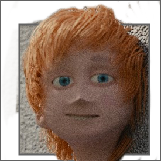

# blender-organizer

  This software was originally developped to organize a short film by J.Y.Amihud ["I'm Not Even Human"](https://www.youtube.com/watch?v=VNH35lKAF-k). The new current version of organizer is developped for his next project. and currently tested of a listle short, short film The Package, The Car and The Time is running out.
  
  With the help of python, blender's bpy module and gtk. I was able to create an amazing tool for people who want to do movies or cartoons using blender as and editing, amiation or vfx tool.
  
  
  
## Current version has:
  
* Analytics functionality.
  * Deadline to project's completion comparison
  * Render's time analytics
  * Competion persantges of any given asset.

* Story editor
  * Writting complex scripts with multiple events happening in the same time.
  * Preview of a script connected from individual events in the editor.
  * Handeling directories and files related to any given shot in the script.

* Assets
  * Handeling directories and files for any asset

* Asset types ( for sorting the assets )
  * Characters
  * Vehicles
  * Locations
  * Objects

* Checklists
  * Main checklist for the whole project
  * Checklists for any given asset

## Learning Materials

  [YOUTBE PLAYLIST OF TUTORIALS](https://www.youtube.com/playlist?list=PLhqk0hUdhXIyuPWCzKncDyx2n_uPXWKrg)
